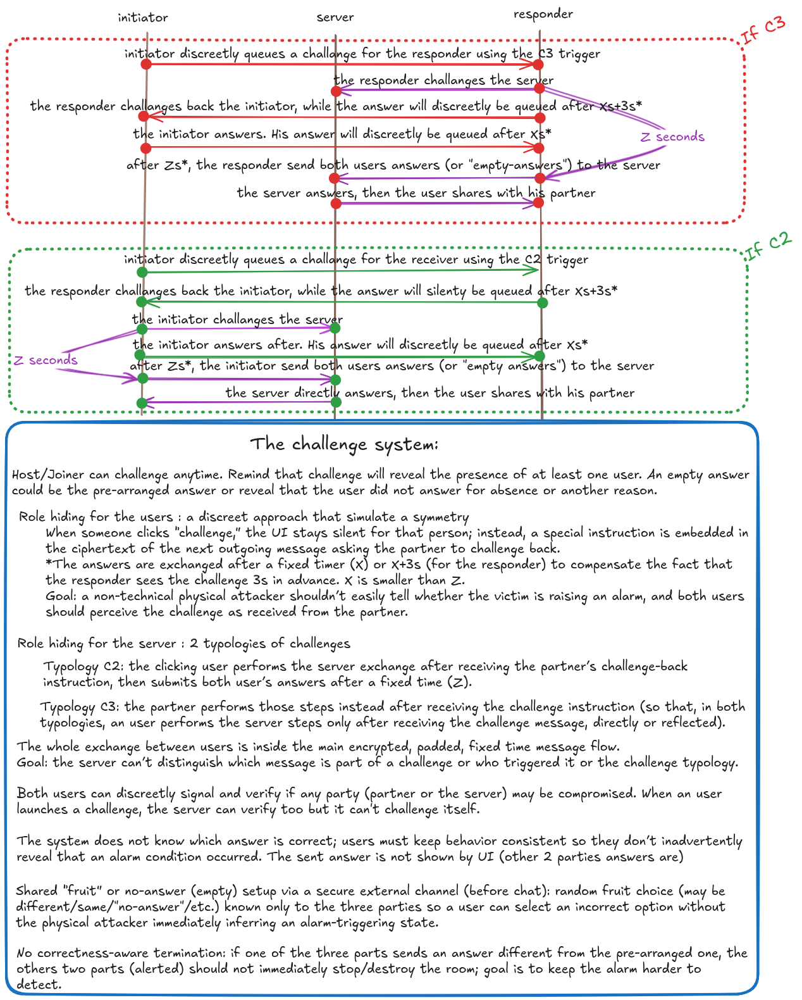
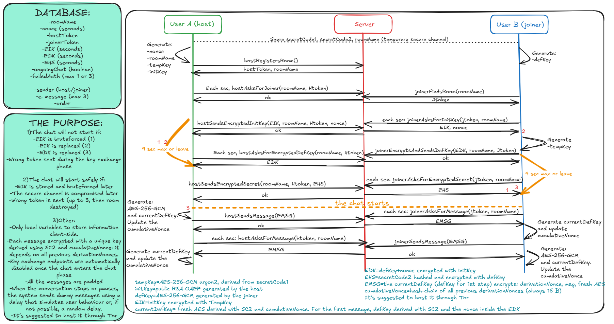

# Chat SDX


## Overview
   Chat SDX is an experimental, minimalist, end‑to‑end, ephemeral chat system built around privacy and security. It assumes that the server may already be compromised before the chat begins and before any keys are exchanged, that the user will not perform manual verifications, and that the frontend running in the browser is genuine and unaltered.

   It requires an external channel, not visible to the server at least until the chat starts, to exchange two secret words and the roomName before the session begins.

   The two secret words must be chosen so that they carry no meaning, appear in no dictionary, and combine words, numbers, and letter cases in a non‑standard way. They must never be reused across different sessions.

   From the start of the key‑exchange phase until after the chat ends, a set of client‑side mechanisms — designed not to rely on the backend — monitors unexpected conditions that could indicate risk and, if necessary, immediately interrupts the session, clears memory, and attempts to delete the room. The user is also assisted by automatic systems that help protect their privacy during and after the session, both at the network level and through self‑destruction mechanisms.

   Encryption uses a strong and distinct key for every message and the compromise of a single message does not allow an attacker to recover previous messages or decrypt future ones.
   Chat SDX places privacy and security decisively above convenience, accepting that the chat could be immediately lost if any indication of risk appears. As a result, it is not suitable for everyday use.
    **It is more an experiment than a product: feedback, reflections and critiques are welcome.**

   A lighter variant of this idea, with some relaxed guarantees (WebRTC, file transfer, save/load, WebSocket), is available at [chat-sdx-lite](https://github.com/Davideva993/chat-sdx-lite).


## Prerequisites
Node.js 18+.


## Security
1. **Chat will not start if**:
   - The encrypted initKey (EIK) was brute-forced (1) because of the independent client‑side timers detecting suspicious delays and ejects users.
   - EIK was replaced (2) because the joiner frontend can't use the genuine tempKey to decrypt EIK and will directly eject him and clear his   memory. The host will be ejected by the timer a few seconds later because he will not receive a valid EDK.
   - The encrypted defKey (EDK) was replaced (3) because the host frontend can't use the genuine initKey to decrypt EDK and will directly eject him and clear his memory. The joiner will be ejected by the timer a few seconds later because he will not receive a valid encrypted SC2 (1 attempt allowed).
   - Someone sends a wrong token (host or joiner) during the key exchange phase (potential active attack).

2. **Chat starts safely if**:
   - EIK is stored and brute-forced later, because the attacker will find initKey (public RSA) that is now useless because it will never be used again.
   - The secure channel is compromised after the key exchange, because SC1, tempKey and initKey are now useless and the SC2 is not enough to break the protocol.
   - Someone sends a wrong token (host or joiner) while the chat is already ongoing (up to 3 attempts; then the room is destroyed).

3. **Chat is compromised if**:
   - An attacker compromises the server and breaks initKey and stores all the blobs since the key exchange and compromises the secure channel after the key exchange or, instead of compromising the secure channel, the SC2 is weak. This attacker can read everything.
   - An attacker compromises the server and the secure channel before the key exchange and is reactive during the key exchange. This attacker could use the initKey to replace the genuine defKey and perform a MITM attack .
   - An attacker compromises the frontend (keylogger, edited frontend...)
   


## Encryption
      -Each chat message, real or dummy, is encrypted with a fresh AES‑GCM key called currentDefKey, derived via Argon2id from a newly generated random AES key (nextAesKey) included in the encrypted message together with the concatenation of SC2 and cumulativeNonce.
      The cumulativeNonce is a 16‑byte hash‑chain built from all previous derivationNonce values included in each message, starting from the nonce sent with the defKey during the key exchange; it is computed independently by both clients, never leaves the browser, and keeps their AES‑GCM key evolution perfectly synchronized.
      SC2 leaves the browser only once, hashed and encrypted, during the final verification step of the key exchange.
      -No encryption key is sent outside the browser before being encrypted with another key: no exception.
      -The initKey is an RSA public key because even if the tempKey (which encrypts the initKey) is compromised later, the defKey it protects remains safe: the RSA private key never leaves the browser. Another reason is that only someone who immediately holds the tempKey can recover the initKey and use it to encrypt the defKey, and any attempt to tamper with the tempKey triggers the safety timers. No trust in the server is required. 

## Network
      -Every message (real or dummy) advances the key chain and is padded to exactly 1024 bytes so an attacker cannot determine the real length of the content. Only real messages are shown in the user interface.
      -Both users check for new messages every 3 seconds. After the first message (sent by the joiner), all subsequent messages are sent 3 seconds after receiving one. If the user does not write anything, the system sends an empty message instead.
      These intervals can be changed using the constants MESSAGE_RESPONSE_DELAY and MESSAGE_GET_DELAY.
      The chat continues for a random duration between 3 and 9 hours if anyone sends a real message but devices stay connected.
      This makes the conversation rhythm independent from user activity: real and dummy messages have the same timing. It significantly helps prevent observers from identifying when real communication is happening thereby increasing the difficulty of targeting meaningful messages.
      Usability is clearly sacrificed.
      -Key exchange endpoints are automatically disabled once the chat phase begins.
      -It's suggested to host it through Tor.

## Memory and Room Deletion
      -The entire client-side script is wrapped in a function to avoid polluting the global scope. No data is stored persistently (e.g., in localStorage or cookies), so a page refresh clears everything from memory.
      -The fields `nonce`, `encryptedInitKey`, `encryptedDefKey`, and `encryptedSecret` are automatically deleted 12 seconds after the joiner enters the room and only the last 3 messages (real or fake) are kept on the server.
      -The backend database is totally ephemeral (in-memory Map).
      -Both participants can delete the room at any time using the button or a page refresh (the room will be cleared by the partner's 15‑second timer when no more messages arrive).
      -The room auto-deletes and the browser memory is cleared after 6 hours of inactivity if the server is still not compromised.
      -If a user doesn't receive any message (dummy or real) for 15 seconds, the system clears all local data and asks the server to delete the room because this unexpected condition could be risky.
      -If a possible attempt to compromise is detected (during the key exchange: keys* or tokens or SC2 mismatch* or suspicious delay > 9 sec*; during the chat: 3 wrong token sent to the server during the chat or the room was deleted by the other user).
      -After 3 to 9 hours of dummy messages, the browser clears all local data and asks the server to delete the room.
  
   *these controls strictly depend on the front-end

## Challenge
Host/Joiner can challenge anytime. Remind that challenge will reveal the presence of at least one user. An empty answer could be the pre-arranged answer or reveal that the user did not answer for absence or another reason.

<a href="challenge.png" target="_blank">
  
</a>

Role hiding for the users: a discreet approach that simulates a symmetry
When someone clicks "challenge," the UI stays silent for that person; instead, a special instruction is embedded in the ciphertext of the next outgoing message asking the partner to challenge back.
The responder sees the challenge approximately 3 seconds before the originator (one round-trip later).
Goal: a non-technical physical attacker shouldn't easily tell whether the victim is raising an alarm, and both users should perceive the challenge as received from the partner.

Role hiding for the server: 2 typologies of challenges
Typology C2: the clicking user performs the server exchange after receiving the partner's challenge-back instruction, then submits both users' answers after a fixed time (Z).
Typology C3: the partner performs those steps instead after receiving the challenge instruction (so that, in both typologies, a user performs the server steps only after receiving the challenge message, directly or reflected).
The whole exchange between users is inside the main encrypted, padded, fixed time message flow.
Goal: the server can't distinguish which message is part of a challenge or who triggered it or the challenge typology.

Both users can discreetly signal and verify if any party (partner or the server) may be compromised. When a user launches a challenge, the server can verify too but it can't challenge itself.

Shared "fruit" or no-answer (empty) setup via a secure external channel (before chat): random fruit choice (may be different/same/"no-answer"/etc.) known only to the three parties so a user can select an incorrect option without the physical attacker immediately inferring an alarm-triggering state.

The system does not know which answer is correct; users must keep behavior consistent so they don't inadvertently reveal that an alarm condition occurred. The sent answer is not shown by UI (the other 2 parties' answers are).

No correctness-aware termination: if one of the three parts sends an answer different from the pre-arranged one, the other two parts (alerted) should not immediately stop/destroy the room; goal is to keep the alarm harder to detect.

   **Server Challenge Auth**
      The server challenge admin page (`serverChallenge.html`) is protected by a simple shared password. The password is set via the `SERVER_PASSWORD` variable in `back/.env`. Every request from the admin page (check, answer, read) includes this password in the request body; the server compares it against the env value and returns 403 if it doesn't match. This prevents anyone without the password from seeing active challenges or picking answers. The admin page automatically connects to the same host it is served from. The `startChallenge` and `endChallenge` routes (used by chat participants) remain unguarded as they rely on room tokens instead.

## Coercion alert
Clicking "!" puts an instruction into the next message, dummy or real, that triggers an alert on the receiver's UI; the sender's UI stays silent. A better fit than the challenge for alerting in some cases, since it avoids reflected challenges being shown at inopportune moments (e.g., an attacker who has just arrived) and doesn't warn the server. The receiver gets a highlighted phrase that disappears when clicked. The signal is one-way and never reflected to the sender.

   ## Frontend
<a href="schema.png" target="_blank">
  
</a>

The steps:
1. The host generates a nonce, the tempKey (using secretCode1 and Argon), the initKey (public RSA-OAEP) then he registers a room and receives the hostToken and the roomName.
2. The host asks every 1.5s if the other user (joiner) joined the room.
3. The joiner generates the defKey (AES), joins the room (with roomName) and receives the joinerToken.
4. The host, knowing the joiner is present, generates a self-destruct timer and sends the initKey encrypted by the tempKey and the nonce to the server.
5. The joiner asks for the nonce and encrypted initKey. Then he generates the tempKey (secretCode1, nonce and Argon) and uses it to decrypt the initKey.
6. The joiner starts a self-destruct timer, encrypts the defKey + random nonce using the decrypted initKey and sends it to the server. The first currentKey is the defKey derived with this nonce and the secretCode2.
7. The host polls every 1.5 s for the defKey encrypted by the initKey. When it arrives it is decrypted, the trailing 16-byte nonce is used with the secretCode2 to derive the first currentKey, and the clean defKey is imported. The self-destruct timer is cleared.
8. The host encrypts the hash of secretCode2 using the defKey and sends it to the server then starts the poling to get new messages.
9. The joiner asks for the encrypted hash of SecretCode2, decrypts it, compares it. If matches, the process is validated and the joiner timer cleared then sends the first message and starts the poling to get new messages.
----the chat starts---
The first message is encrypted (and decrypted) with defKey derived with the nonce (step 6 or 7) and the secretCode2 and sent by the joiner. Then:
10. The sender encrypts a message (3 digit ASCII length of the real message + the realMessage (can be dummy) + random byte padding to exactly 1024 bytes) + a fresh AES + a nonce (derivationNonce) using currentDefKey and sends it. Then updates cumulativeNonce (first message: defKey as currentKey and the nonce sent with defKey as derivationNonce and secretCode2; later: SHA-256(old||new)[0:15]) and derives the next currentDefKey = AES derived with secretCode2 + cumulativeNonce. 
11. The receiver decrypts using currentDefKey, gets the AES and derivationNonce, updates cumulativeNonce exactly the same way (SHA-256(old||new)[0:15]), then derives the next currentDefKey = the received AES derived with secretCode2 + cumulativeNonce. Finally, he sends a message (a dummy one if the user doesn't send a real message) after 3 seconds.

 


   ## Backend
```
/*-----NAME-------------------------------------------INPUT------------------------------------OUTPUT--------
 STEP 1: hostRegistersRoom()                         ------                                   roomName, hostToken
 STEP 2: joinerFindsRoom()                           roomName                                 joinerToken 
 STEP 3: hostAsksForJoiner()                         roomName, hostToken                      ------
 STEP 4: hostSendsEncryptedInitKeyAndNonce()         roomName, hostToken en. initKey, nonce   ------
 STEP 5: joinerAsksForEncryptedInitKeyAndNonce()     roomName, joinerToken                    en. initKey
 STEP 6: joinerSendsEncryptedDefKey()                roomName, joinerToken, en. defKey        ------
 STEP 7: hostAsksForEncryptedDefKey()                roomName, hostToken                      en. defKey and nonce***
 STEP 8: hostSendsEncryptedSecret()                  roomName, hostToken, en. hashed secret   -------
 STEP 9: joinerAsksForEncryptedSecret()              roomName, joinerToken                    en. hashed secret
 -------------------------------------------CHAT STARTS----------------------------------------------------
```

## Message structure
currentDefKey encrypts: `{len3||realMessage||paddingBytes||nextAesKey||derivationNonce(16B)}`
```
*len3 = 3‑digit ASCII length of the real message (e.g., "004")
*realMessage= the actual user message (e.g., "Café")
*paddingBytes= random bytes to reach exactly 1024 bytes
*nextAesKey = a fresh AES key that will be combined with cumulativeNonce and secretCode2 to derive the next currentDefKey
*derivationNonce= fresh nonce generated by the sender for each message, always encrypted with currentDefKey when it leaves the browser
*cumulativeNonce= hash-chain of all previous derivationNonces (always 16 B)
*currentDefKey= Argon2id(nextAesKey, secretCode2 + cumulativeNonce)
***The first message is encrypted with defKey derived with this nonce and secretCode2
```


## Run (Frontend)
`chat-sdx.html` is a single self-contained file that includes the HTML, CSS, JavaScript and images. It's suggested to download it, open it in a text editor, change the `API_URL` constant to your backend address (e.g. your `.onion` URL), and use the file locally in your browser.


## Run (Backend)
```bash
cd back
npm i
npm start
```

## Tests
```bash
cd front && node test.js
cd back && node test.js
```
Requires Node.js 18+ (uses the built‑in `node:test` module). No additional test dependencies needed.

## License
Released under the AGPL‑3.0 license — see the LICENSE file for details.
